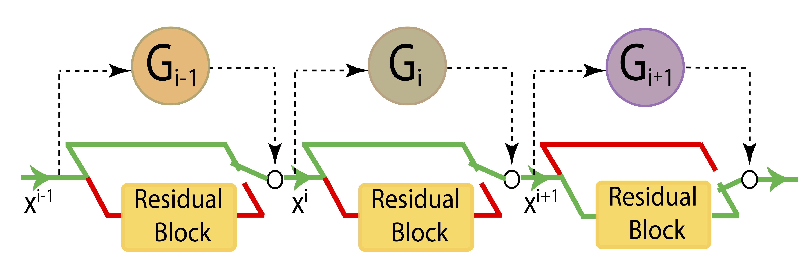
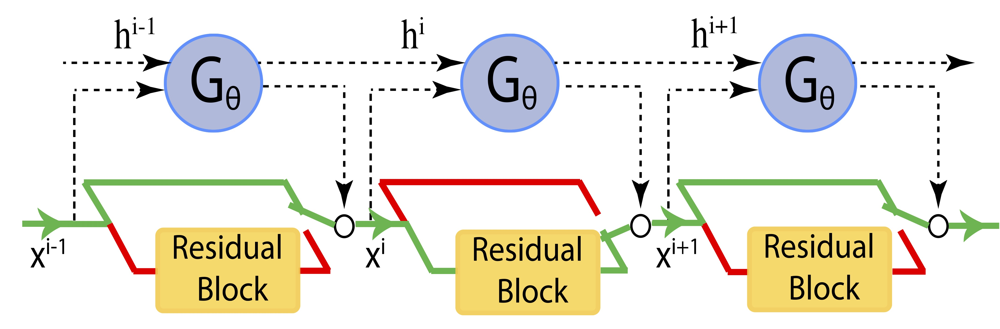

# SkipNet: Learning Dynamic Routing in Convolutional Networks

This repository contains the code and trained models for [SkipNet](https://arxiv.org/pdf/1711.09485.pdf).

SkipNet learns to route images through a subset of layers on a per-input basis. Challenging images are routed through more
layers than easy images. We talk about two model designs with both feedforward gates and reccurent gates which enable 
different levels of parameter sharing in the paper.  The model illustrations are as follows.

  
   

For other details, please refer to the [paper](https://arxiv.org/pdf/1711.09485.pdf). 

## Updates 
* [March 2, 2018] add trained model checkpoints on the CIFAR-10 dataset
* [March 1, 2018] upgrade ImageNet code to support Pytorch 3.0; add trained model checkpoints for ResNet-101 and ResNet-50

## SkipNet on CIFAR datasets
All the model configuration and training/evaluation code are available under `./cifar`. If you want to train your own 
SkipNet, you can follow the [document](cifar/README.md) under the same folder. 

## SkipNet on ImageNet datasets 
Similarly, the model configuration and train/evaluation code are available under `./imagenet`. Detailed instructions can
be found in the [document](imagenet/README.md) under the same folder. 

