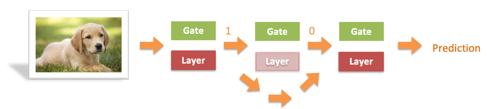
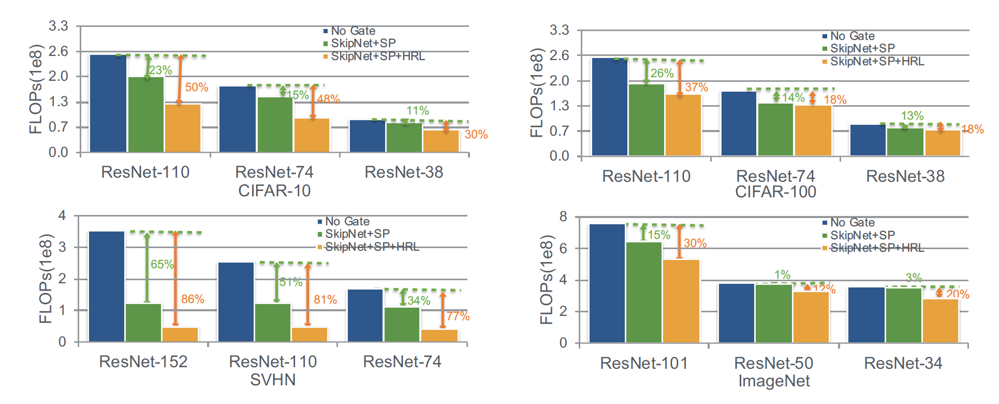
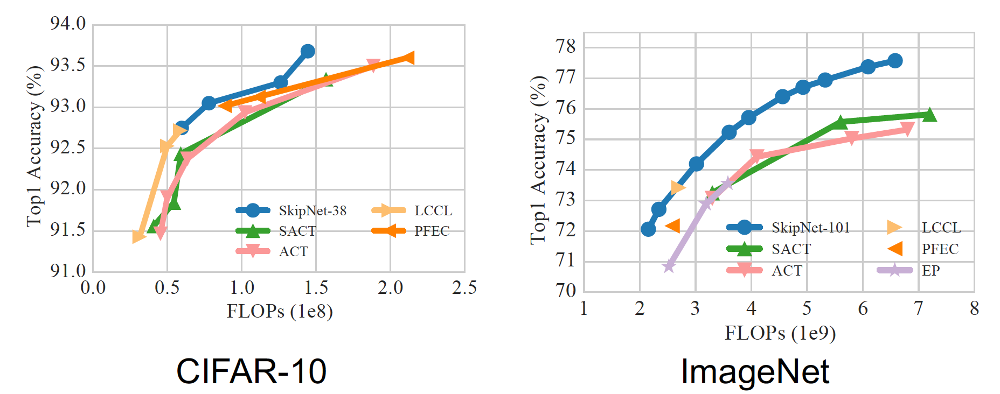

# Abstract 
While deeper convolutional networks are needed to achieve maximum
accuracy in visual perception tasks, for many inputs shallower networks are sufficient.
We exploit this observation by learning to skip convolutional layers on a
per-input basis. We introduce SkipNet, a modified residual network, that uses a
gating network to selectively skip convolutional blocks based on the activations
of the previous layer. We formulate the dynamic skipping problem in the context
of sequential decision making and propose a hybrid learning algorithm that combines
supervised learning and reinforcement learning to address the challenges
of non-differentiable skipping decisions. We show SkipNet reduces computation
by 30-90% while preserving the accuracy of the original model on four benchmark
datasets and outperforms the state-of-the-art dynamic networks and static
compression methods. We also qualitatively evaluate the gating policy to reveal a
relationship between image scale and saliency and the number of layers skipped.

# Workflow


# Key Results
## Image Classification


## Comparion with other Approaches


# Citation
If you find our work is useful, please consider citing 
```
@InProceedings{Wang_2018_ECCV,
author = {Wang, Xin and Yu, Fisher and Dou, Zi-Yi and Darrell, Trevor and Gonzalez, Joseph E.},
title = {SkipNet: Learning Dynamic Routing in Convolutional Networks},
booktitle = {The European Conference on Computer Vision (ECCV)},
month = {September},
year = {2018}
}
```


